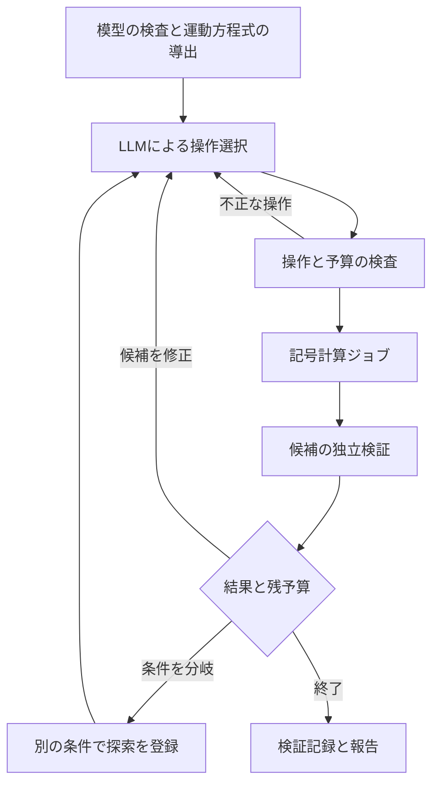

# 非線形シグマ模型のLax接続探索エージェント：アーキテクチャ

設計日：2026年9月8日。対象リポジトリ：`ryos-physrockme/nlsm-lax-agent`。
設計開始時のコミットは `8fbdc356965d0076355c477858207c4ca99704a3` で、内容はREADMEのみだった。
本書のモジュール、インターフェース、設定項目は実装仕様案であり、実装済み機能を表さない。

## 1. 目的と初期構成

入力された2次元非線形シグマ模型について、Lax接続の候補を提案し、記号計算の結果を受けて候補を修正する。成果物は、候補の数式、成立する結合定数の条件、検証可能な計算記録、および未確認事項である。物理的な検証条件は[物理検証仕様](verification.ja.md)で定義する。

初期リリースでは単一のLLMが次の操作を選択する。複数のLLMによる役割分担は導入しない。フレームワークによる状態管理と、物理計算の正しさを担う部分を分離する。

| 要素 | 採用案 | このプロジェクトでの役割 |
| --- | --- | --- |
| 言語・依存管理 | Python 3.12、uv | パッケージ、固定された依存バージョン、実験環境の記録 |
| 物理計算 | SymPy | 厳密係数、Lie代数成分、曲率、係数方程式、代入検証 |
| 入出力検査 | Pydantic 2、JSON Schema | 型、許容値、式の構文、返却データの検査 |
| エージェント実行 | LangGraphの`StateGraph` | 分岐、反復、チェックポイント、中断再開 |
| LLM接続 | LiteLLM Python SDK | OpenAI、Anthropic、ローカル推論を共通のインターフェースで呼ぶ |
| 履歴 | SQLite、JSON Lines、ファイル | ジョブ状態、操作履歴、大きな数式、検証記録 |
| 利用方法 | Python、コマンドライン、MCP | 人間と既存のエージェントから同じ機能を利用 |
| 追加の記号計算 | WolframScriptアダプター | 必要な計算だけを別プロセスで実行。任意依存 |

LangGraphはチェックポイントによる再開を備え、開発時にはSQLiteを利用できる。この機能を、長時間の記号計算と探索履歴の管理に使う。[LangGraph公式資料](https://docs.langchain.com/oss/python/langgraph/persistence)

## 2. フレームワークの選定

| 候補 | 判断 | 理由 |
| --- | --- | --- |
| LangGraph | 初期の実行管理に採用 | 検証後の分岐と再開位置をコードで指定したい |
| PydanticAI | 代替候補 | 複数のLLMプロバイダーに対応する。将来比較する場合も物理計算を共有できる |
| OpenAI Agents SDK | 初期の実行管理には採用しない | LangGraphと実行ループの責務が重なる。LLMへの通信はLiteLLMに任せる |
| 自作のPythonループ | 比較実験に用意 | 固定手順・ランダム探索を、同じ物理ツールと予算で評価する |

PydanticAIのプロバイダー対応は[公式資料](https://pydantic.dev/docs/ai/models/overview/)を参照。採用判断は機能の優劣を一般化したものではなく、この研究で再開・分岐・実行記録を管理するための実装上の選択である。

LangGraphには物理の判定を実装しない。LLMへの通信はLiteLLM Python SDKの`acompletion`に集約する。探索側には以下の小さなインターフェースを置き、実験に固有の状態・予算・操作型を扱う。各社SDKを直接呼ぶアダプター群は作らない。

初期はLiteLLMをPythonプロセス内のライブラリとして使う。独立したProxyサーバーは、複数のマシンから共通の接続先を使う必要が出た時点で導入する。モデルごとの設定はプロファイルとして外出しし、プロファイルの選択で切り替える。[LiteLLM公式資料](https://docs.litellm.ai/docs/)

LiteLLM Routerのfallbackや負荷分散は後から利用できる。ただし初期の比較実験では、1実行につき1つの固定モデルに接続し、プロバイダーをまたぐ自動fallbackを無効にする。[Router公式資料](https://docs.litellm.ai/docs/routing)

## 3. LLMバックエンド

| 用途 | 初期候補 | 接続 | 選定の意味 |
| --- | --- | --- | --- |
| 開発・自動テスト | `mock` / `replay` | 保存した応答を返す | APIキー不要で分岐と再開を検証する |
| 最初の探索実験 | `openai/gpt-6-astra` | LiteLLMからOpenAIへ | 強いモデルを比較の基準に置き、まずツール側の不足を調べる |
| 別プロバイダーとの比較 | `anthropic/claude-opus-5` | LiteLLMからAnthropicへ | 同じ入力・ツール・予算で検証済み成果の差を測る |
| ローカルでの比較 | `Qwen/Qwen3-4B`を出発点とする | LiteLLMからLM StudioのOpenAI互換APIへ | 小型モデルの基準実験と、後の追加学習の比較対象 |

GPT-6 Astraのfunction calling、structured outputs、`reasoning.effort="high"`の対応は[OpenAIのモデル資料](https://developers.openai.com/api/docs/models/gpt-6-astra)で確認した。Claude Opus 5の識別子は[Anthropicのモデル資料](https://platform.claude.com/docs/en/models/opus-5/overview)で確認した。これは可積分性探索における能力比較の結果ではない。実際のアカウントでの利用可否と接続は未検証である。

ローカルモデルは最新・最良という位置付けではなく、固定した比較対象である。[Qwen3-4Bのモデルカード](https://huggingface.co/Qwen/Qwen3-4B)と[LM Studioの互換API資料](https://lmstudio.ai/docs/developer/openai-compat)を基準にする。16 GBのGPUでは、まず4 bit量子化と短いコンテキストでメモリ使用量を測る。重み以外に推論時のキャッシュと実行環境のメモリが必要なため、モデルサイズだけから動作を保証しない。サーバーが返すモデルID、元の重みのrevision、量子化方式、チャットテンプレートを実験記録に残す。

`LLMBackend.next_action(request) -> response` を唯一の探索側インターフェースとする。実装は`LiteLLMBackend`、`MockBackend`、`ReplayBackend`の3つで始める。LiteLLMが担うプロバイダー切り替えを、この層で重複実装しない。

| 型 | 必須の内容 |
| --- | --- |
| `LLMRequest` | 模型の要約、検証済みの状態、選べる操作、過去の失敗の要約、残予算、プロバイダー固有の会話継続情報 |
| `LLMResponse` | 操作1件、その引数、短い選択理由、使用量、返却モデルID、request ID、更新された会話継続情報 |
| `BackendCapabilities` | tool calling、schema制約、出力上限、推論設定、利用量取得の対応状況 |

共通の呼出しは`acompletion(model=profile.model, messages=..., tools=..., **profile.parameters)`とする。設定にプロバイダー接頭辞付きの`model`、必要なら`api_base`、環境変数から読むAPIキー、対応する推論設定を持たせる。LiteLLMの[OpenAI互換接続](https://docs.litellm.ai/docs/providers/openai_compatible)を使い、ローカルではサーバーが返すモデルIDの前に`openai/`を付ける。

OpenAIでは`strict=true`のfunction callingを使い、並列tool callを無効にする。全フィールドをrequiredにし、任意項目はnullを許す。各objectには`additionalProperties=false`を付ける。これらは[function callingの公式仕様](https://developers.openai.com/api/docs/guides/function-calling)に合わせる。LiteLLM経由でその設定が維持されることも接続テストで確認する。Pydantic側でも独立に検査し、構文の正しさと物理的な正しさを分ける。

tool-call ID、返却メッセージ、会話継続に必要なプロバイダー固有の情報はLiteLLMの形式を保って保存する。本文文字列だけを抜き出して会話履歴を再構築しない。LiteLLMは推論内容を含むメッセージも扱うが、モデルやAPIによる差があるため、実際のtool callとtool resultの往復を確認する。[LiteLLMの推論メッセージ仕様](https://docs.litellm.ai/docs/reasoning_content)

プロバイダーを変更する場合は、検証済みの状態から新しい会話を開始し、変更を履歴に記録する。推論設定、出力上限、structured outputsの対応を全モデルで同一だとは仮定しない。未対応パラメータの黙った削除は無効にし、対応状況を確認したプロファイルだけを使用する。[LiteLLMのstructured outputs資料](https://docs.litellm.ai/docs/completion/json_mode)

ローカル接続では、起動時の小さな接続確認でtool callingとJSON Schemaの対応を調べる。schema制約が使えなければ、JSONを返させてPydanticで検査する。その方式も評価条件として記録する。壊れた応答には検査エラーを1回返して修正を求め、それでも失敗したら`invalid_action`として保存する。

## 4. モジュールと依存関係

単一リポジトリ、単一Pythonパッケージから開始する。以下は作成予定の配置である。

| 配置 | 責務 | 依存の制約 |
| --- | --- | --- |
| `src/nlsm_lax/schemas/` | 入力、式、操作、計算結果の型 | Pydanticと標準ライブラリ |
| `src/nlsm_lax/core/` | 模型、変分、Lie代数、曲率、検証 | LLM、LangGraph、MCPをimportしない |
| `src/nlsm_lax/solvers/` | 係数方程式の解法、数値候補からの厳密係数の復元 | `core`で最終候補を再検証 |
| `src/nlsm_lax/tools/` | 登録済み関数の公開、ジョブへの変換 | 同じ関数をPythonとMCPから呼ぶ |
| `src/nlsm_lax/agent/` | 状態遷移、文脈の構築、終了条件 | LangGraphはこの層に置く |
| `src/nlsm_lax/backends/llm/` | LiteLLM、mock、replay | LiteLLMはエージェント用の任意依存 |
| `src/nlsm_lax/backends/wolfram/` | WolframScriptとの入出力 | Wolfram導入なしでも基本機能を使える |
| `src/nlsm_lax/storage/` | 実行記録、ジョブ状態、数式ファイル | LangGraphのチェックポイントとは別に記録 |
| `src/nlsm_lax/cli.py`、`mcp_server.py` | コマンドラインとMCP | 物理計算を再実装しない |
| `benchmarks/`、`tests/` | 模型、期待される判定、独立した検算 | 正解データは探索時の入力から除外 |

Model Context Protocol（MCP）はツールを外部クライアントから呼ぶための接続方式である。LangGraph内部ではPython関数を直接呼び、通信を経由させない。MCPサーバーは標準入出力で動かす小さなラッパーとし、同じ引数・同じ返却型を使う。これにより、既存のコーディングエージェントから手動でツールを使う実験も、自動探索と比較できる。

SymPyとWolframの間に汎用の記号計算言語は作らない。まず`solve_constraints`など用途を限定した境界を設け、厳密な係数と式のデータを渡す。Wolframの実行パスは設定で指定し、WindowsとLinuxで共通だと仮定しない。

## 5. 探索の状態遷移

LLMの操作は`propose_ansatz`、`revise_ansatz`、`restrict_parameters`、`inspect_artifact`、`stop`に限定する。候補を提出すると、実行管理が制約の構築・求解・検証を順に行う。LLMには検証を省略する操作や、合格状態を書き込む操作を与えない。式の次数や項数、補助Lie代数、分母の形などは宣言された探索範囲内で変更できる。

`restrict_parameters`は元の模型を上書きせず、条件を追加した子実行を作る。兄弟の実行の条件や結果を混同しない。条件を外した一般模型への結論は自動的に拡張しない。

初期の状態`SearchState`は以下を持つ。

| フィールド | 意味 |
| --- | --- |
| `run_id`, `parent_run_id` | 実行と条件分岐の識別子 |
| `model_ref`, `domain_ref`, `equations_ref` | 改変しない模型、適用領域、独立な方程式の記録 |
| `candidate_refs`, `active_candidate_ref` | 候補の履歴と現在の候補 |
| `pending_job_ids`, `completed_result_refs` | 計算の進行状態 |
| `verification_refs` | 検証器が生成した結果 |
| `remaining_budget`, `failure_counts` | 残予算と失敗回数 |
| `backend_session_ref`, `event_offset` | 会話の継続情報と履歴の位置 |

大きな式や全ログをLangGraphの状態に埋め込まず、保存先とハッシュを保持する。LLMには非零残差の代表成分、欠けた方程式、分母条件、求解が完了した範囲を短く返す。追加の式は必要な部分を指定して読む。

## 6. 物理ツールの契約

| Python / MCPの操作名 | 入力 | 出力と役割 |
| --- | --- | --- |
| `validate_model` | `ModelSpec` | 計量、添字、Lie代数、定義域の検査結果 |
| `derive_equations` | 模型と定義域 | 運動方程式、恒等式、使用した独立な成分 |
| `build_lax_constraints` | 模型、`AnsatzSpec` | 曲率と、候補係数が満たす代数方程式 |
| `solve_constraints` | 制約、求解範囲、資源上限 | 候補解、除外条件、解集合を尽くしたかどうか |
| `verify_curvature` | 候補、模型 | 曲率を再構築した結果、前向きの恒等式 |
| `recover_equations` | 曲率の係数、方程式 | 回収式、rank、非零小行列式、適用条件 |
| `check_spectral_parameter` | 候補、許した変換のクラス | 依存性、除去変換の有無、未確認範囲 |
| `read_artifact` | 記録IDと成分・範囲 | 保存した式や検証記録の一部 |

関数は同じ入力形式の通常のPython呼出しでも利用できる。長い計算はジョブとして登録し、`get_job`と`cancel_job`で状態を取得・停止する。キャンセルや時間切れは数理的な不成立と区別する。

共通の返却型`ToolResult`には、`execution_status`、`claim_status`、`assumptions_ref`、`artifact_refs`、`diagnostics`、実行時間、バックエンドのバージョンを含める。`execution_status`は`completed`、`timeout`、`error`、`unsupported`、`cancelled`から選ぶ。`claim_status`は`established`、`refuted`、`unresolved`、`not_applicable`から選ぶ。たとえば候補の曲率残差が非零であることは、その候補を反証するが模型の非可積分性を意味しない。

数値探索器は後から`solve_constraints`の候補生成部分へ接続する。数値で小さい残差が出た場合は`candidate`を返し、厳密係数の復元と記号的な代入検証が終わるまで確認済みの結果にしない。

## 7. 式と探索記録

内部の可換な係数はSymPyで扱う。外部入出力は、整数、有理数、宣言済み記号、和、積、整数冪、登録済み関数を表すJSONの式木とする。式木は演算と引数を記録する形式である。外部から受け取った文字列を`eval`や無制限の`parse_expr`へ渡さない。Lie代数値の場は成分と構造定数で表し、非可換な積を通常のスカラー積へ変換しない。

`ModelSpec`には、場と座標、作用の規約、計量と反対称テンソル、結合定数、定義域、境界条件、Lie代数または座標表示、参照文献を含める。模型名だけを入力にしない。`AnsatzSpec`には、補助Lie代数、接続を構成する項、未知係数、スペクトルパラメータの関数クラス、次数上限、除外する極を含める。

実行ごとに`manifest.json`、`events.jsonl`、`artifacts/`を保存する。`manifest.json`にはソースのcommitと未コミット差分のハッシュ、依存ロックファイルのハッシュ、入力、プロンプト、ツールschema、モデルID、推論設定、数値乱数seedを記録する。外部サービスのモデルが変わり得る場合は、識別可能なrevisionと実行日を残す。新しいLLM応答の完全再現と、保存した応答を使うreplayを区別する。

操作履歴は入力、操作、短い選択理由、ツール結果、検証結果、費用を含む。非公開の内部推論を取得する設計にはしない。失敗した探索も記録するが、そのまま「非可積分」という学習ラベルには変換しない。

## 8. 資源上限と再開

初期のクラウド設定案は、LLMリクエスト20回、候補10件、数理計算ジョブ40件、実行全体1時間を上限とする。LLMの修正要求と通信再試行も回数・費用に含める。単一ジョブは120秒、メモリは2 GiBを初期上限とし、超過した計算は別プロセスを終了する。

クラウドの予算案は1実行10米ドルである。これは実際の消費額の予測ではない。API呼出し前に、入力と出力上限から保守的な費用を予約し、結果で精算する。価格の確認日と料金区分を設定に保持し、価格や利用量が不明な場合は課金を伴う次の呼出しを停止する。タイムアウトしたリクエストの予約を勝手に返金扱いにせず、確認待ちにする。外部API側で既に発生した課金をクライアントから取り消すことはできない。

ジョブには、入力ハッシュ、ツール名とバージョン、定義域、資源上限、seedから作るキーを付ける。完了結果は一時ファイルからのatomic renameとデータベースのトランザクションで登録する。プロセスが終了して再開した場合、完了済み結果を再利用し、実行中だったジョブは生存確認後に再登録する。時間切れは同じ設定では再計算しないが、資源上限を変えた新しいジョブは許す。

LangGraphのノードが再実行される可能性を前提とする。物理ジョブの再利用とAPIリクエストの記録はアプリケーション側でも行う。チェックポイントだけで外部処理の一度限りの実行が保証されるとは仮定しない。

## 9. 初期範囲と拡張

最初の到達点は、主カイラル模型の既知Lax接続を回収し、運動方程式を含まない平坦な接続を区別し、途中から再開できる探索を実行することである。主カイラル模型は以下でPCM（principal chiral model）と略記する。

次に2次元球面のシグマ模型、複数のPCMを結合した有限パラメータの作用へ広げる。これらは実装と条件探索の検証に使う。既知分類との対応を確認する前に、新しい可積分模型を発見したとは扱わない。

normal variational equation、Kovacic algorithm、散乱振幅、数値的なカオスの診断は拡張用のインターフェースに留める。normal variational equationは、ある解の近傍の変分方程式から解に沿う方向を除いた方程式である。初期リリースで一般的な非可積分性判定やHamiltonian構造の自動証明を提供するとは約束しない。

最初に機械学習で更新する対象はLLMの重みではなく、探索に使うツールと評価問題である。十分な検証済み操作履歴が得られた後で、候補修正やツール選択を小型モデルへ追加学習させる実験を別の段階として行う。
